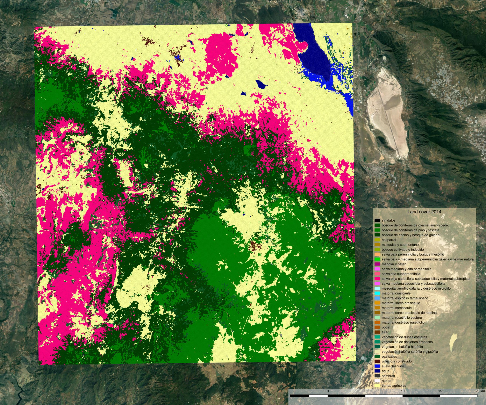
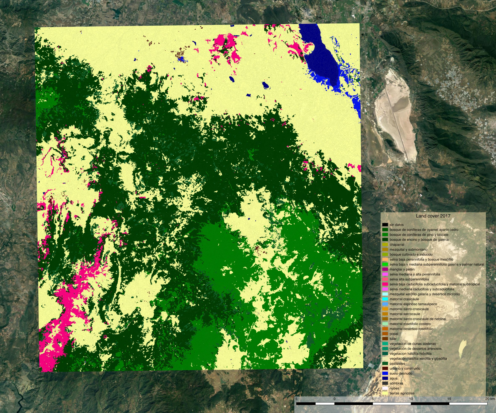
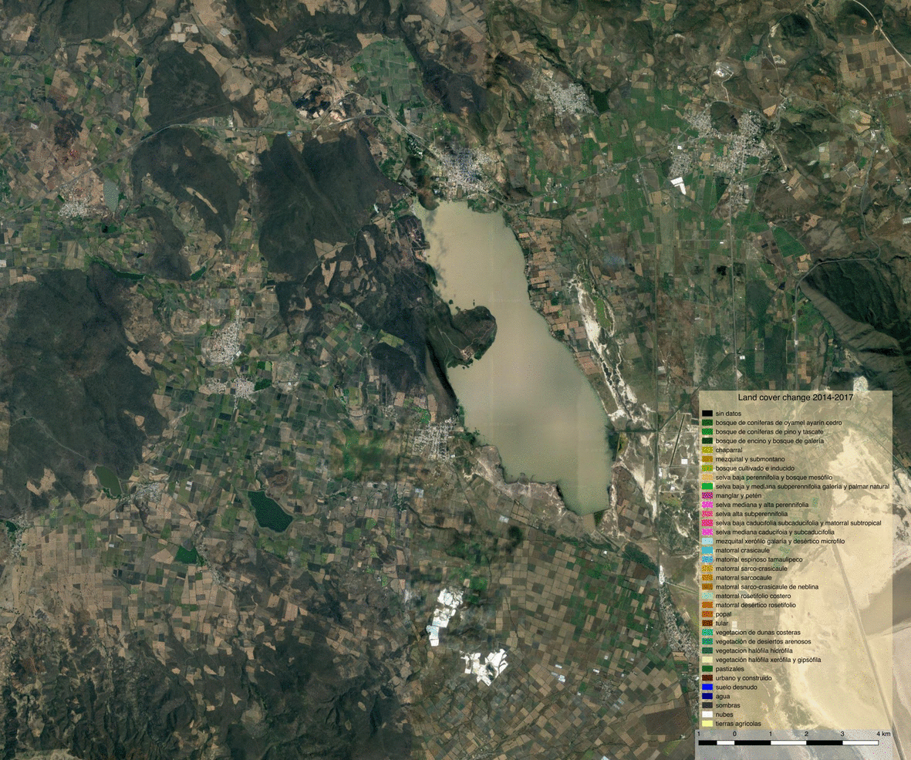

*********************************************
Land cover and land cover change: API example
*********************************************

Introduction
============

The example below walks you through the process of generating land cover and land cover change information, taking as example a small region of the state of Jalisco, Mexico. The steps described do not make use of the command line functionalities of antares, but instead use the API directly. While we do not recommend direct use of the API for map production over large areas, it is essential for developers, maintainers and people who want to extent the antares system to understand the antares mechanisms and philosophy. This example aims at building this kind of understanding.

Fully understanding the tutorial requires knowledge of some key python geospatial concepts and data structures. They are briefly reminded below:

- Feature collection: a valid feature collection in python is a list of geojson features. Features are dictionaries that each contain at least a geometry and a dictionary of properties. `The geojson specifications <http://geojson.org/>`_ defines the structure of valid geojson features. Sometimes, lists of ``(geometry, value)`` tuples are referred to as features collections. This is an abuse as they are not list of valid geojson features, however, this way of organizing data is often used in the internals of antares since it maps to database inserts and queries.

- ``xarray`` ``DataArray`` s, ``Dataset`` s and ``geoarrays``: The ``xarray`` python package introduces two data structures; the ``DataArray`` and the ``Dataset``. Excellent documentation can be found `here <http://xarray.pydata.org/en/stable/>`_ to understand ``xarray``'s paradigm and how to work with these data structures. In the example we sometimes refer to ``geoarrays``. They are ``Datasets`` with a few additional attributes (namely ``crs``, ``geobox``, ``affine``, etc) and are usually returned by calls to datacube.

- Basic python data structures and operations: lists, tuples, dictionaries and list comprehensions. Here list comprehensions is the preferred way to manipulate features collections (e.g.: change structure of features, reproject, filter on attributes, etc).

madmex - antares / antares - madmex ???
=======================================

In the text below reference is made to both madmex and antares. Truth be told we like both names which makes it hard to decide how to name things. We inheritted the madmex name from previous systems built at CONABIO and keep calling things that way, but we also like antares. As it stands now, antares is the name of the system and madmex the name of the python package that makes the system. 

Inventory
=========

The starting point for the steps described below is the following:

- A system with antares and datacube successfully installed
- Landsat 8 data ingested in the datacube under the product name ``ls8_espa_mexico`` (we ingested year 2014 and 2017 over a small region of interest near guadalajara, state of Jalisco, Mexico).
- CGIAR void filled 90m SRTM DEM ingested under the name ``srtm_cgiar_mexico``
- Training data ingested in the antares database using the ``antares ingest_training`` command line and registered under the name ``jalisco_bits``

Summary of steps
================

We'll produce two land cover maps for the year 2014 and 2017, and a land cover change map. The following steps are required:

- Load raw data for both years
- Compute modeling features (vegetation indices and temporal statistics) for both years
- Load the training data that intersect with the region of interest
- Overlay training data with modeling features to extract training arrays
- Train a model
- Run spatial segmentation and retrieve geometries
- Overlay geometries from the segmentation with modeling features to extract prediction arrays
- Predict land cover for each geometry of the segmentation
- Detect spectral changes between the years
- Filter and classify the changes

Loading the libraries
=====================

.. code-block:: python

    # Python standard library
    from datetime import datetime
    from pprint import pprint

    # External libraries
    from datacube import Datacube
    from datacube.storage import masking
    import xarray as xr
    import numpy as np
    import fiona

    # MAdmex imports
    from madmex.util.xarray import to_float, to_int
    from madmex.segmentation.bis import Segmentation
    from madmex.overlay.extractions import zonal_stats_xarray
    from madmex.io.vector_db import VectorDb
    from madmex.modeling.supervised.lgb import Model
    from madmex.lcc.bitemporal.distance import BiChange

Load data over a small study area
=================================

This is a small study area (approximately 40 x 40 km) near the city of Guadalajara.

.. code-block:: python

    dc = Datacube(app = 'jalisco_lcc')
    sp_query = {'product': 'ls8_espa_mexico',
                'x': (-104, -103.6),
                'y': (20, 20.4)}
    geoarray_pre = dc.load(**sp_query,
                           time=('2014-01-01', '2014-12-31'),
                           group_by='solar_day')
    geoarray_post = dc.load(**sp_query,
                           time=('2017-01-01', '2017-12-31'),
                           group_by='solar_day')
    print(geoarray_pre)

.. parsed-literal::

    <xarray.Dataset>
    Dimensions:   (time: 4, x: 1407, y: 1497)
    Coordinates:
      * time      (time) datetime64[ns] 2014-01-20T17:19:17.728594 ...
      * y         (y) float64 9.398e+05 9.398e+05 9.397e+05 9.397e+05 9.397e+05 ...
      * x         (x) float64 2.292e+06 2.292e+06 2.292e+06 2.292e+06 2.292e+06 ...
    Data variables:
        blue      (time, y, x) int16 567 605 518 492 513 396 424 434 417 420 414 ...
        green     (time, y, x) int16 793 851 742 706 713 574 572 566 554 554 543 ...
        red       (time, y, x) int16 935 1039 858 792 818 590 608 606 587 584 ...
        nir       (time, y, x) int16 2227 2353 2278 2350 2471 2255 2000 1861 ...
        swir1     (time, y, x) int16 2936 3007 2687 2766 2582 2184 2212 2239 ...
        swir2     (time, y, x) int16 2093 2119 1841 1818 1692 1432 1464 1523 ...
        pixel_qa  (time, y, x) int16 322 322 322 322 322 322 322 322 322 322 322 ...
    Attributes:
        crs:      PROJCS["unnamed",GEOGCS["WGS 84",DATUM["unknown",SPHEROID["WGS8...

Compute modeling features
=========================

We chose here to construct modeling features by applying temporal reduction to the Landsat spectral bands as well as vegetation indices. These temporally reduced features are combined with terrain metrics, resulting in 15 features.
The complete set or subsets of these features will be used in various steps of the process.

We define a function that performs the temporal reduction and combine the resulting features with terrain metrics. The function returns a ``Dataset``. Note that this reduction process is entirely pixel based, so that the spatial characteristics of both geoarrays remain unchanged.

.. note:: This is what ``antares apply_recipe`` does when the system is operated from the command line, the ``landsat_prepare_features`` function was actually taken from one of the existing recipes.

.. code-block:: python

    def landsat_prepare_features(sr):
        clear = masking.make_mask(sr.pixel_qa, cloud=False, cloud_shadow=False,
                                      snow=False)
        sr_1 = sr.where(clear)
        sr_1 = sr_1.drop('pixel_qa')
        sr_1 = sr_1.apply(func=to_float, keep_attrs=True)
        # Compute vegetation indices
        sr_1['ndvi'] = ((sr_1.nir - sr_1.red) / (sr_1.nir + sr_1.red)) * 10000
        sr_1['ndvi'].attrs['nodata'] = -9999
        sr_1['ndmi'] = ((sr_1.nir - sr_1.swir1) / (sr_1.nir + sr_1.swir1)) * 10000
        sr_1['ndmi'].attrs['nodata'] = -9999
        # Run temporal reductions and rename DataArrays
        sr_mean = sr_1.mean('time', keep_attrs=True, skipna=True)
        sr_mean.rename({'blue': 'blue_mean',
                        'green': 'green_mean',
                        'red': 'red_mean',
                        'nir': 'nir_mean',
                        'swir1': 'swir1_mean',
                        'swir2': 'swir2_mean',
                        'ndmi': 'ndmi_mean',
                        'ndvi': 'ndvi_mean'}, inplace=True)
        # Compute min/max/std only for vegetation indices
        ndvi_max = sr_1.ndvi.max('time', keep_attrs=True, skipna=True)
        ndvi_max = ndvi_max.rename('ndvi_max')
        ndvi_max.attrs['nodata'] = -9999
        ndvi_min = sr_1.ndvi.min('time', keep_attrs=True, skipna=True)
        ndvi_min = ndvi_min.rename('ndvi_min')
        ndvi_min.attrs['nodata'] = -9999
        # ndmi
        ndmi_max = sr_1.ndmi.max('time', keep_attrs=True, skipna=True)
        ndmi_max = ndmi_max.rename('ndmi_max')
        ndmi_max.attrs['nodata'] = -9999
        ndmi_min = sr_1.ndmi.min('time', keep_attrs=True, skipna=True)
        ndmi_min = ndmi_min.rename('ndmi_min')
        ndmi_min.attrs['nodata'] = -9999
        # Load terrain metrics using same spatial parameters than sr
        dc = Datacube(app = 'feature_creation')
        terrain = dc.load(product='srtm_cgiar_mexico', like=sr,
                          time=(datetime(1970, 1, 1), datetime(2018, 1, 1)))
        dc.close()
        # Merge dataarrays
        combined = xr.merge([sr_mean.apply(to_int),
                             to_int(ndvi_max),
                             to_int(ndvi_min),
                             to_int(ndmi_max),
                             to_int(ndmi_min),
                             terrain])
        combined.attrs['crs'] = sr.attrs['crs']
        return combined

The function can then be applied to both input arrays (2014 and 2017).

.. code-block:: python

    features_pre = landsat_prepare_features(geoarray_pre)
    features_post = landsat_prepare_features(geoarray_post)
    print(features_pre)

.. parsed-literal::

    <xarray.Dataset>
    Dimensions:     (time: 1, x: 1407, y: 1497)
    Coordinates:
      * y           (y) float64 9.398e+05 9.398e+05 9.397e+05 9.397e+05 ...
      * x           (x) float64 2.292e+06 2.292e+06 2.292e+06 2.292e+06 ...
      * time        (time) datetime64[ns] 2000-02-16T12:00:00
    Data variables:
        blue_mean   (y, x) int16 663 695 605 643 624 448 476 486 469 480 477 491 ...
        green_mean  (y, x) int16 977 1033 883 950 940 644 642 645 624 635 626 ...
        red_mean    (y, x) int16 1240 1335 1124 1201 1180 764 763 761 736 750 ...
        nir_mean    (y, x) int16 2560 2708 2495 2714 2758 2149 1995 1902 1803 ...
        swir1_mean  (y, x) int16 3183 3282 2994 3151 3109 2442 2416 2442 2478 ...
        swir2_mean  (y, x) int16 2216 2251 1990 2068 2043 1632 1643 1681 1720 ...
        ndvi_mean   (y, x) int16 3539 3451 3857 4012 4146 4776 4502 4330 4248 ...
        ndmi_mean   (y, x) int16 -1092 -964 -901 -738 -554 -617 -937 -1223 -1556 ...
        ndvi_max    (y, x) int16 4113 3977 4534 4958 5076 5852 5468 5242 5126 ...
        ndvi_min    (y, x) int16 2861 2861 3030 2993 3050 3480 3421 3326 3226 ...
        ndmi_max    (y, x) int16 -949 -820 -749 -536 -151 159 -345 -662 -1033 ...
        ndmi_min    (y, x) int16 -1373 -1220 -1115 -834 -1033 -1460 -1556 -1678 ...
        elevation   (time, y, x) int16 1745 1745 1745 1731 1731 1731 1710 1710 ...
        slope       (time, y, x) float32 18.342178 18.342178 18.342178 20.278563 ...
        aspect      (time, y, x) float32 163.92642 163.92642 163.92642 148.74905 ...
    Attributes:
        crs:      PROJCS["unnamed",GEOGCS["WGS 84",DATUM["unknown",SPHEROID["WGS8...

Load the training data
======================

As mentioned earlier, training data have been ingested in the database. We'll retrieve a random subset of them. The code below sends a query to the database to identify geometries that spatially intersect with the geoarrays and retrieve them as a feature collection. We're assuming that these labelled geometries represent true land cover. 

Because the training data represents a complete map (spatially continuous), we'll only load a random subset of it.

.. code-block:: python

    loader = VectorDb()
    fc_train_0 = loader.load_training_from_dataset(dataset=features_pre,
                                                   training_set='jalisco_bits', sample=0.3)
    # Evaluate the generator (safe to do here since the data is relatively small)
    fc_train_0 = list(fc_train_0)
    pprint(fc_train_0[0])

.. parsed-literal::

    {'geometry': {'coordinates': [[[2326252.027988377, 910734.3428333736],
                                   [2326261.9863412823, 910734.1467824185],
                                   [2326261.8882086305, 910729.1380236337],
                                   [2326266.867385206, 910729.0399985655],
                                   [2326266.6711206264, 910719.0224803672],
                                   [2326271.6502976064, 910718.9244556869],
                                   [2326271.552165666, 910713.9156962705],
                                   [2326281.5105198696, 910713.7196477344],
                                   [2326281.6086513186, 910718.7284069781],
                                   [2326231.620611946, 910709.6911390346],
                                   [2326231.52247825, 910704.6823784625],
                                   [2326236.5016564964, 910704.5843524567],
                                   [2326236.4035231196, 910699.5755917204],
                                   [2326246.3618798703, 910699.3795405444],
                                   [2326246.4600127693, 910704.3883011278],
                                   [2326251.439190782, 910704.2902757933],
                                   [2326251.635456333, 910714.3077960224],
                                   [2326246.656278798, 910714.4058215156],
                                   [2326246.950678438, 910729.4321001584],
                                   [2326251.929855247, 910729.3340744303],
                                   [2326252.027988377, 910734.3428333736]]],
                  'type': 'Polygon'},
     'properties': {'class': 153},
     'type': 'Feature'}

The property here refers to a unique database id for the class. Although convenient for interacting with the database, this is not very meaningful in the present case. Because we know much better the numeric codes of the madmex classification scheme, we will convert these database indices to the known madmex classes numeric codes.

.. code-block:: python

    from madmex.models import Tag
    qs = Tag.objects.filter(scheme='madmex')
    tag_mapping = {x.id:x.numeric_code for x in qs}
    tag_id_list = [x['properties']['class'] for x in fc_train_0]
    fc_train = [{'geometry': x[0]['geometry'],
                 'properties': {'code': tag_mapping[x[1]]},
                 'type': 'feature'} for x in zip(fc_train_0, tag_id_list)]
    pprint(fc_train[0])

The same feature now appears with the numeric code ``2`` instead of the tag-id ``153``.

.. parsed-literal::

        {'geometry': {'coordinates': [[[2326252.027988377, 910734.3428333736],
                                       [2326261.9863412823, 910734.1467824185],
                                       [2326261.8882086305, 910729.1380236337],
                                       [2326266.867385206, 910729.0399985655],
                                       [2326266.6711206264, 910719.0224803672],
                                       [2326271.6502976064, 910718.9244556869],
                                       [2326271.552165666, 910713.9156962705],
                                       [2326281.5105198696, 910713.7196477344],
                                       [2326281.6086513186, 910718.7284069781],
                                       [2326231.620611946, 910709.6911390346],
                                       [2326231.52247825, 910704.6823784625],
                                       [2326236.5016564964, 910704.5843524567],
                                       [2326236.4035231196, 910699.5755917204],
                                       [2326246.3618798703, 910699.3795405444],
                                       [2326246.4600127693, 910704.3883011278],
                                       [2326251.439190782, 910704.2902757933],
                                       [2326251.635456333, 910714.3077960224],
                                       [2326246.656278798, 910714.4058215156],
                                       [2326246.950678438, 910729.4321001584],
                                       [2326251.929855247, 910729.3340744303],
                                       [2326252.027988377, 910734.3428333736]]],
                      'type': 'Polygon'},
         'properties': {'code': 2},
         'type': 'Feature'}

Train a model
=============

In the present case, we are not saving the model to the database or doing any other kind of antares specific operations related to modeling, so that we do not really benefit from using the ``Model`` class from the ``madmex.modeling.supervized`` submodules. Calling the scikit learn interface of lightGBM would provide the same results, however, for consistency with the rest of the tutorial we will use the madmex modeling interface.

Extract training features
-------------------------

Similarly to scikit learn, madmex's modeling interface takes numpy arrays as input and returns numpy arrays too. At the moment we have a feature collection of labelled geometries on one side and an xarray Dataset of features on the other side. We extract the data to labels and predictors arrays (``y``, ``X``) using the ``zonal_stats_xarray()`` function from madmex's ``overlay`` module.

.. code-block:: python

    X_train, y_train = zonal_stats_xarray(features_pre, fc_train, 'code')

Training the model
------------------

The model can now be trained using scikit learn like syntax.

.. code-block:: python

    # Instantiate Model class of lgb submodule
    lgb_model = Model()
    lgb_model.fit(X_train, y_train)

.. note:: How many models should we train? We have the options of either training a single model and use it to predict over both years, or training two separate models for each years. Both approaches are sub-optimal; the trade-off is between accepting that some of the training data may not completely represent reality (in case of land cover change between training data generation and year considered for the modeling features), and accepting that the modeling feature may not be completely stable over time.

.. note:: The command line ``antares model_fit`` combines the steps from loading the training data, up to this point.

Run a spatial segmentation
==========================

The ``segmentation`` module offers an interface to segment georeferenced arrays (``numpy.ndarray`` + affine + crs or datacube like ``xarray.Dataset`` (``geoarrays``)), generate feature collections and interact with the database. Here we use the Berkeley image segmentation algorithm (bis) as seen in the imports section. We limit the number of input bands for the segmentation to two, ``ndvi_mean`` and ``ndmi_mean``, and run the segmentation on both geoarrays (2014 and 2017).

.. code-block:: python

    s_bands = ['ndvi_mean', 'ndmi_mean']
    Segmenter_pre = Segmentation.from_geoarray(features_pre[s_bands], t=20)
    Segmenter_post = Segmentation.from_geoarray(features_post[s_bands], t=20)
    Segmenter_pre.segment()
    Segmenter_post.segment()

The first step of the segmentation process generates an array of segmented zones, written to a slot of the class instance. The ``polygonize()`` method allows to generate a feature collection, written to the ``fc`` attribute of the instance. We can then access this attribute and inspect it.

.. code-block:: python

    Segmenter_pre.polygonize(crs_out=None)
    Segmenter_post.polygonize(crs_out=None)
    fc_seg_pre = list(Segmenter_pre.fc)
    fc_seg_post = list(Segmenter_post.fc)
    pprint(fc_seg_pre[0])
    print(len(fc_seg_pre))
    print(len(fc_seg_post))

.. parsed-literal::
    
    {'geometry': {'coordinates': [[(2291520.0, 939800.0),
                                   (2291520.0, 939680.0),
                                   (2291550.0, 939680.0),
                                   (2291550.0, 939650.0),
                                   (2291580.0, 939650.0),
                                   (2291580.0, 939680.0),
                                   (2291610.0, 939680.0),
                                   (2291610.0, 939800.0),
                                   (2291520.0, 939800.0)]],
                  'type': 'Polygon'},
     'properties': {'id': 46678.0},
     'type': 'Feature'}
    243983
    201879

We now have for each year a feature collection whose geometries correspond to the spatial segments generated by the segmentation algorithm. The result of ``len(fc_seg_pre)`` let us appreciate the average object size. In the present case we obtained 243,983 and 201,879 which sounds like an acceptable segmentation for Landsat data, considering the input array contain 2,106,279 pixels (about 10 pixels per object on average).

.. note:: When operating antares from the command line, segmentation as above is ran via ``antares segment`` command.

Predict land cover
==================

We now have a trained model, a feature collection of segments and a set of geometric features. For each of the two years, we therefore need to prepare the prepare the array of predictors, predict the label for every observation and combine labels with geometries into a feature collection.

Extract prediction features
---------------------------

.. code-block:: python

    X_pre, _ = zonal_stats_xarray(features_pre, fc_seg_pre, 'id')
    X_post, _ = zonal_stats_xarray(features_post, fc_seg_post, 'id')

Run trained model in prediction mode
------------------------------------

.. code-block:: python

    y_pre = lgb_model.predict(X_pre)
    y_post = lgb_model.predict(X_post)

Combined predicted labels with segmentation geometries
------------------------------------------------------

Here we're building a list of `(geometry, value)` tuples.

.. code-block:: python

    fc_pred_pre = [(x[0]['geometry'], x[1]) for x in zip(fc_seg_pre, y_pre)]
    fc_pred_post = [(x[0]['geometry'], x[1]) for x in zip(fc_seg_post, y_post)]

    pprint(fc_pred_pre[0])

.. parsed-literal::

    ({'coordinates': [[(2291520.0, 939800.0),
                       (2291520.0, 939680.0),
                       (2291550.0, 939680.0),
                       (2291550.0, 939650.0),
                       (2291580.0, 939650.0),
                       (2291580.0, 939680.0),
                       (2291610.0, 939680.0),
                       (2291610.0, 939800.0),
                       (2291520.0, 939800.0)]],
      'type': 'Polygon'},
     28)

.. note:: The land cover prediction described above reproduces the steps taken by ``antares model_predict_object`` command line. 

Change detection and labeling
=============================

Detect spectral change
----------------------

.. code-block:: python

    lcc_pre = BiChange.from_geoarray(features_pre[s_bands], threshold = 3000)
    lcc_post = BiChange.from_geoarray(features_post[s_bands])
    lcc_pre.run(lcc_post)
    print(lcc_pre.change_array.sum() / lcc_pre.change_array.size)

.. parsed-literal::

    0.0087

Given the ``change_array`` attribute of the ``BiChange`` class instance is a 2D array of zeros and ones (ones correspond to change and zeros to no change), the array sum tells us the number of pixels labelled as change. In the present case, a bit less than 1 percent of the pixels were labelled as change.

Clean and label changes
-----------------------

Three steps:

- Minimum mapping unit filter
- Pixels labelling using pre and post land cover maps
- Filter features having same pre and post land cover label

First filter: minimum mapping unit
^^^^^^^^^^^^^^^^^^^^^^^^^^^^^^^^^^

It does an update of the `change_array` attribute of the class instance.

.. code-block:: python

    lcc_pre.filter_mmu(5000)
    print(lcc_pre.change_array.sum() / lcc_pre.change_array.size)

.. parsed-literal::

    0.0077

Assign pre and post labels to change layer
^^^^^^^^^^^^^^^^^^^^^^^^^^^^^^^^^^^^^^^^^^

.. code-block:: python

    fc_change = lcc_pre.label_change(fc_pred_pre, fc_pred_post)
    print(len(fc_change))

.. parsed-literal::

    1813

Second filter: No change in label
^^^^^^^^^^^^^^^^^^^^^^^^^^^^^^^^^

.. code-block:: python

    fc_change = lcc_pre.filter_no_change(fc_change)
    print(len(fc_change))

.. parsed-literal::

    1152

.. note:: ``antares detect_change`` is the command line equivalent of the bi-temporal change detectiomn and classification steps described above. 

Write output to a vector file
=============================

The change feature collection is a list of tuples ``(geometry, pre_label, post_label)``, we therefore need to transform it to a geojson compliant feature collection before writing it to a vector file for visualization in an external program (e.g. QGIS).

.. code-block:: python

    import fiona
    from fiona.crs import from_string
    from madmex.util.spatial import geometry_transform
    fc_change_geojson = [{'geometry': geometry_transform(x[0], crs_in=lcc_pre.crs, crs_out='+proj=longlat'),
                          'properties': {'lc_2014': x[1], 'lc_2017': x[2]},
                          'type': 'feature'} for x in fc_change]
    fc_schema = {'geometry': 'Polygon',
                 'properties': {'lc_2014': 'int',
                                'lc_2017': 'int'}}
    crs = from_string('+proj=longlat')
    with fiona.open('/home/madmex_user/lc_lcc_api_example.gpkg', 'w',
                    driver='GPKG', schema=fc_schema,
                    layer='change', crs=crs) as dst:
        dst.writerecords(fc_change_geojson)

Opening the vector file in QGIS allows us to visualize detected changes.

We can also write the land cover maps of 2014 and 2017 to visualize them

.. code-block:: python

    fc_schema = {'geometry': 'Polygon',
                 'properties': {'lc': 'int'}}

    # Build valid geojson features for both land cover maps
    fc_pred_pre_geojson = [{'geometry': geometry_transform(x[0], crs_in=lcc_pre.crs, crs_out='+proj=longlat'),
                            'properties': {'lc': int(x[1])},
                            'type': 'feature'} for x in fc_pred_pre]
    fc_pred_post_geojson = [{'geometry': geometry_transform(x[0], crs_in=lcc_pre.crs, crs_out='+proj=longlat'),
                             'properties': {'lc': int(x[1])},
                             'type': 'feature'} for x in fc_pred_post]

    # Write 2014 map
    with fiona.open('/home/madmex_user/lc_lcc_api_example.gpkg', 'w',
                    driver='GPKG', schema=fc_schema,
                    layer='lc_2014', crs=crs) as dst:
        dst.writerecords(fc_pred_pre_geojson)

    # Write 2017 map
    with fiona.open('/home/madmex_user/lc_lcc_api_example.gpkg', 'w',
                    driver='GPKG', schema=fc_schema,
                    layer='lc_2017', crs=crs) as dst:
        dst.writerecords(fc_pred_post_geojson)

Antares can produce a QGIS style to enhance visualization of that particular classification scheme, by running the command line ``antares generate_style madmex --type vector --filename madmex.qml``.

Visualization and observations
==============================

Using the previously generated file we produced maps of the various products using QGIS.

Land cover
----------

   Land cover map 2014

   Land cover map 2017

Despite using the same model for prediction, large differences appear between the two land cover maps. The most striking difference concerns a confusion between the *selva baja caducifolia subcaducifolia* and *tierras agricolas* class. Spectral proximity of these two classes is probably high, making the prediction sensible to features instability over time. While the small study area and the lack of quantitative validation figures does not allow for firm conclusion, this certainly questions the choice of reusing the same model for prediction at different time steps without prior normalization of the features.

Land cover change
-----------------

   Land cover change animation

The underwhelming animation above present change in land cover between 2014 and 2017.

